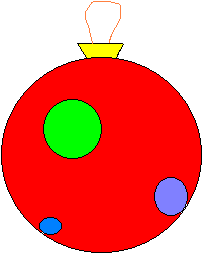

# Daily Coding Problem #645 [Medium]

## Problem Statement

Given a 2-D matrix representing an image, a location of a pixel in the screen and a color C,
replace the color of the given pixel and all adjacent same colored pixels with C.

For example, given the following matrix,
```text
B B W
W W W
W W W
B B B
```

and location pixel of `(2, 2)`, and 'G' for green, return:
```text
B B G
G G G
G G G
B B B
```

> Note: for this implementation, the colour replacer does not replace colours in diagonally adjacent pixels. 
> After playing around with [an online paint tool](https://paint.js.org/) (brings me back), that should be the correct
> behaviour for a colour replacer/bucket tool.


